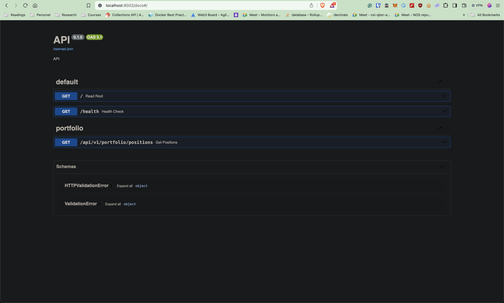
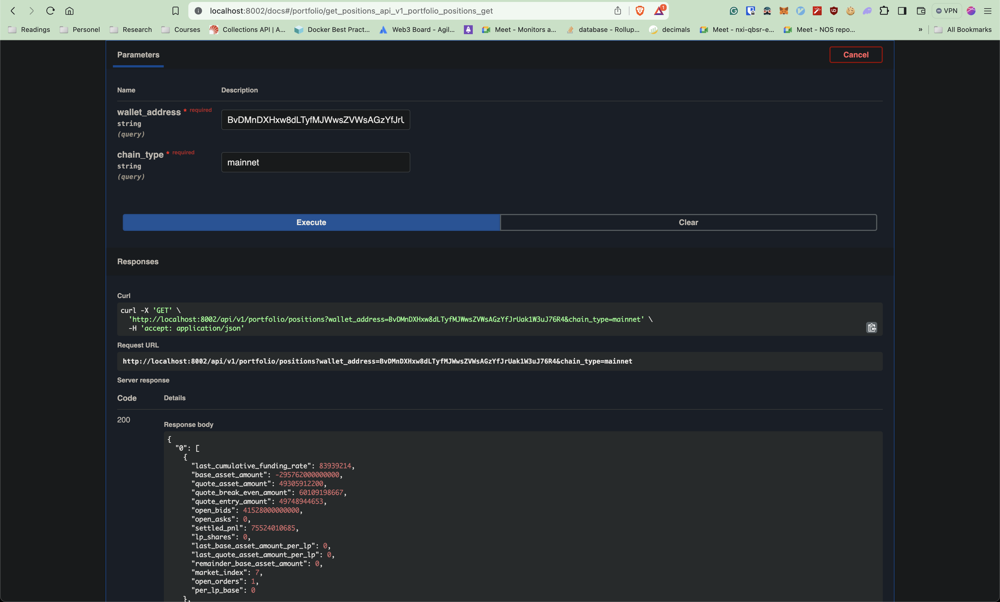

# Portfolio Tracker Service

## Overview

The Portfolio Tracker service is designed to help users monitor their positions and balances across various protocols on the Solana blockchain. It provides an easy-to-use interface for tracking assets, ensuring that users can keep tabs on their investments with minimal hassle.

## Getting Started

### Prerequisites

- Ensure you have Python installed (preferably 3.8 or higher).
- Docker should be installed if you prefer running the service using Docker.

### Environment Setup

1. Create a `.env` file in the root directory of the project.
2. Add the following fields to the `.env` file, replacing `<API_KEY>` with your actual API keys:
   ```env
   SOLANA_MAINNET_RPC_URL=https://mainnet.helius-rpc.com/?api-key=<API_KEY>
   SOLANA_DEVNET_RPC_URL=https://devnet.helius-rpc.com/?api-key=<API_KEY>
   ```

## Running the Service

### 1. Running Locally

#### Install Requirements

First, install the necessary dependencies:

```bash
pip install -r requirements.txt
```

#### Start the Service

You can start the service using either of the following methods:

- Using Bash:

  ```bash
  bash deployment/app.sh
  ```

- Using Gunicorn directly:
  ```bash
  gunicorn main:app
  ```

### 2. Running with Docker

#### Build and Run

Build the Docker image:

```bash
docker build -f deployment/Dockerfile . -t quant-portfolio
```

Run the Docker container:

```bash
docker run -p 8002:8001 --env-file .env quant-portfolio
```

#### Build Docker image in Github Actions
tags like `v*.*.*` trigger CI Docker image builds
```bash
git tag v0.0.2
git push origin v0.0.2
```

### 3. Using Packaged Docker Image

#### Pull and Run

Pull the pre-built Docker image from GitHub Container Registry:

```bash
docker pull ghcr.io/crypto_quants/portfolio_tracker:<TAG>
```

Run the Docker container:

```bash
docker run -p 8001:8001 --env-file .env ghcr.io/crypto_quants/portfolio_tracker:<TAG>
```

## Usage

Once the service is running, you can access the Swagger documentation to explore the API endpoints and test the service.

- Open your web browser and navigate to:
  ```
  http://localhost:<PORT>/docs
  ```

## Screenshots




---

Feel free to raise issues in the repository. Happy tracking!
